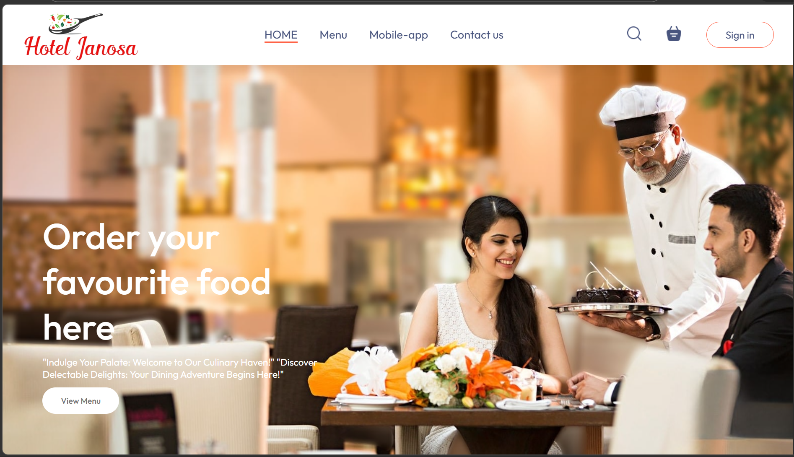
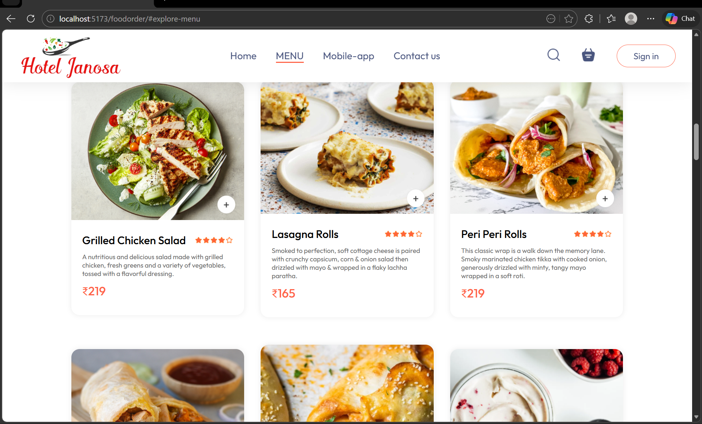
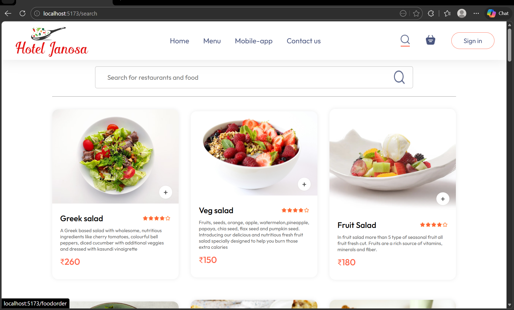
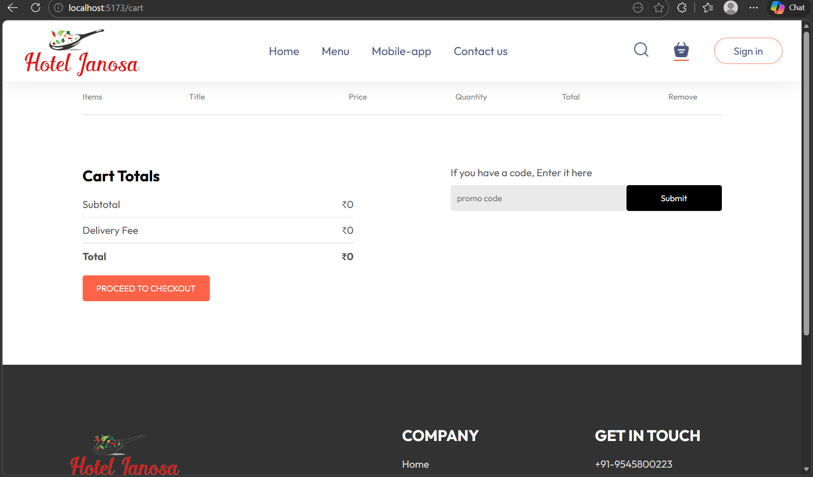
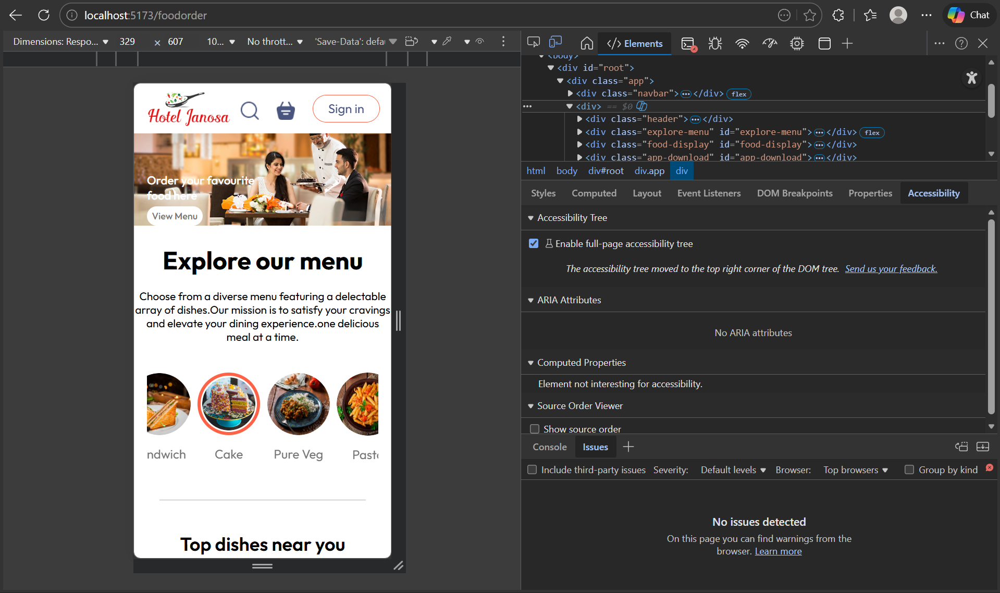

# 🍔 FoodieMate – Food Ordering Web App

A modern food ordering web application built with React and Vite, allowing users to explore menus, search for dishes, manage their cart, and place orders seamlessly. Designed with a responsive UI to ensure a smooth experience across all devices.

## 📸 UI Preview

### 🏠 Home

### 📋 Menu

### 🔍 Search

### 🛒 Cart

### 🧾 Checkout
